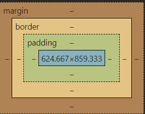

# Class 2 CSS

## Things To Download This Week (Todays date 02/07/2024)
1. Markdown All in One extension in vscode (optional)
  

## Weekly important links:
* [google fonts](https://fonts.google.com/)

## Table of contents:
1. Introduction to Markdown
2. Why CSS
3. How to add CSS
4. CSS Selectors
5. Font Properties
6. Inspecting CSS
7. The Box Model(Margin, Padding, Borders)
8. The Cascading System (Specificty and Inheritance)
9. Combining CSS Selectors
10. CSS Positioning
11. CSS Display
12. Float
13. Media Queries
14. Notes

Next class we will pick up on **CSS Combining CSS Selectors**  

## 1. Introduction to Markdown
Markdown is a lightweight markup language for creating formatted text using a plain-text editor using the '.md' extension. Open this file(readme.md) in VScode and go through formatting!

## 2. Why CSS?
Cascading style sheets(CSS) is a type of language used in conjunction with HTML to help design the look and feel of a website. Using CSS instead of solely using HTML allows us to add design to a webpage in a modular(as programmers modularity is always good) fashion. Separation of content(HTML) and design(CSS) makes code more readable and reusable(you can use the same CSS code on multiple html files to accomplish similar styles across several web pages).

## 3. How to add CSS?
There are three methods to add CSS:
*  Inline
*  Internal 
*  External
 

**Inline** is the least popular and messiest way to add CSS to your webpage and HTML files. This method modifies tags directly used in your HTML code[(Example)](./implementing_css_example/inline_css.html).
  

**Internal** is better than inline, and has more use cases when writing simple websites(usually single page websites). Internal CSS uses the \<style\> tag, and should be defined within the \<head\> tag of your html file. Internal CSS uses something called selectors, to select tags and modify their styling and attributes[(Example)](./implementing_css_example/internal_css.html).

**External** is the most commonly used and seen implementation of CSS, and it works the same as internal css, with the exception that we have a .css which will contain all the CSS code. This implementation of CSS is useful for mult-page websites[(Example)](./implementing_css_example/external_css.html).

## 4. CSS Selectors
A selector is a method for selecting objects in CSS for modification. 
**Types of Selectors:**
* **Element selector** - explicitly selects the tag(examples: body, h1 , h2, p, etc.). 
* **Class selector** - A class is an attribute that you can add to any tag(\<h1 class="header"\>). In CSS you can specify the class, with the dot operator: *.class_name*.
* **id selector** - An id is an attribute that you can add to any tag(\<h1 id="header"\>). In CSS you can specify the class, with the pound operator: *#id_name*. The id selector differs from the class selector because the id of a particular tag must be unique.
* **Attribute selector** - An attribute is an input parameter given to some tag, for example the anchor tag(\<a href=""\>) attribute href, amongst others which are not specified. To use the attribute selector you must specify a tag, followed by an attribute within square brackets. An example p[class="first-p"].
* **Universal selector** - Applies changes to all tags and uses the * operator.
  
Example for using CSS external with all the above selectors [click-here](./selectors_example/selectors.html)

## 5. Font Properties
List of some important font-properties you can modify:
*  color - change color of the font 
*  font-weight - change weight of font by making it bolder
*  font-family - change the font(times new roman, sans serif)
*  font-size - size of the font(can be measured in pt(whats used word) ,px (pixels), em(relative to parent tag size) and rem(relative to root font size))
  
Example for font properties [click-here](./font_properties_example/index.html)

## 6. Inspecting CSS
You can view the html and css code by visting any random website and right clicking anywhere on the screen and clicking the 'inspect' button. Try for yourself and play around with it! [click-here](https://theuselessweb.com/)

## 7. The Box Model
Every element(aka tag you add to html file) will have an underlying box-model that defines the space that the element takes up on your website. For example whenever I change the attribute 'background-color' I am altering the color of the box-model for that given element [(see-here)](./box_model_example/show_box-model_for_h1.html)
  
The box-model consist of three parts:
* **border** - Determines an outter border for the box containg the contents of the tag(example -- border: 10px solid black;)
* **padding** - Adds space(in pixels) between the content of the tag and the border(example -- padding: 20px;)
* **margin** - Adds space(in pixels) between the border and adjacent box models(example -- margin: 20px;)
**Note:** Each of these parts can be used with top,bottom, left and right keywords to set spacing in a certain direction. 
  
 

 
We can also use the \<div\> tag to group elements together and create larger box-models that contain more than one element. 
[Example](./box_model_example/index.html)

## 8. The Cascading System
There is a defined order that attribute values get applied to elements in the case where there is more than one assignment.   
From lowest to highest priority.
1. Positioning: bottommost elements have higher priority
2. Specificity(selectors): Universal, Element, Class,id, Attribute(lowest - highest priority)
3. Type: external, internal, inline (lowest - highest priority)
4. Importance: use of keyword '!important' next to attribute

[Example](./the_cascading_system/index.html)

## 9. Combining CSS Selectors
You can combine different CSS selectors using certain operators, to apply your CSS rules more specifically and more generally.
### List of operators  
1. Comma operator ',': You can combine CSS selectors using a comma, which will apply your rules(attribute values) to all the css selectors. Example: h1, h2, p {color: green}, all h1,h2 and p tags will have the font color green. 
2. Child operator '\>': You can modify all tags that satisfy the 'parent \> child' relationship. Example: ul \> li{color: blue}, will change the font color of all li elements that are children of the ul elements to blue. 
3. Descendant operator ' '(denoted with a space between selectors), is the more general case of the child operator and specifies whether the lefthand selector is an ancestor of the righthand selector 'ancestor descendant'. Example: .box li{color: yellow} turns all li elements who have an ancestor with the .box class to the font color yellow. 
4. Chaining selectors works a bit different and does not use an explicit operator. Instead it places selectors adjacently with no spaces in between. If you are using an element selector it must be placed at the beginning of the chained selector. Chaining selectors are used to find very specific tags. Example: p.class1{color: orange}, chains the paragraph element selector with a class selector, to change the font to orange for all tags that have their element as p and have a class of "class1".
5. You are also allowed to combine all the above! Example: ul > p.obtained{font-size: 2rem} 

[Class Example](./combining_css_selectors/index.html)

## 10. CSS Positioning
* Static Positioning - Defaults to the next slot to put the item(can't be moved).
* Relative Positioning - Relative to default position.
* Absolute Positioning - Position relative to nearest positioned ancestor(parent) or top left corner of webpage
* Fixed Positioning - Position relative to top left corner of browser window(not webpage).

[Class Example](./css_positioning/index.html)

## 11. CSS Display
* inline: Used to place items on the same line(box is as small as possible)(p{display:inline;})
* block: Uses the box-model to place boxes vertically on webpage(Usually default)(p{display:block;})
* inline-block: Allows boxes to be placed on same line(p{display:inline-block;})

[Class Example](./css_display/index.html)

## 12. Float
Float is used to have text wrap around images as shown in [Example](./float/index.html)

## 13. Media Queries
Media queries is our first example of website responsiveness. It allows us to to modify our website based on its window size.
* @media (max-width: 400px){...} is the syntax that works for modifying the css code of a window size between 0-400px.
* @media (min-width: 300px){...} is the syntax that works for modifying the css code of a window size between 300px-max window size.
* @media (min-width: 300px) and (max-width: 500px){...} is the syntax that works for modifying the css code of a window size between 300px-500px.
* @media (max-width: 300px) and (min-width: 500px){...} is the syntax that works for modifying the css code of a window size between from 0px-300px and 500px-max window size.

See [Example](./media_queries/index.html)

## 14. Notes
* Next class flex, Grid, bootstrap
* Play with box-model on chrome
* Note that class="first second" is how you assign two classes to the same tag.

<!-- ## Homework Assignment
Create 5 boxes diagonally using the box-model and the tag \<div\>, and have their borders double as you go down the page. Write any text you'd like in each of the boxes with all the padding attributes set to 10px. See examples from class 2 lecture on github. Submit the deployed website like you did for question 1. -->

