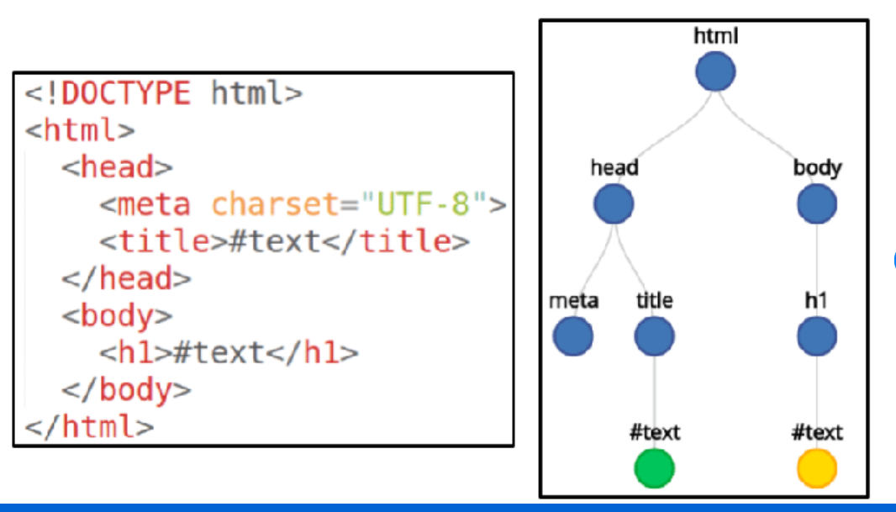

# Class 8 Document Object Model (DOM)

## Table of contents:
1. Links
2. Javascript and the Document Object Model
3. JQuery
4. Notes
   

## Links
* [Dom Doc](https://www.w3schools.com/jsref/dom_obj_style.asp)
* [Event Listener Doc](https://developer.mozilla.org/en-US/docs/Web/API/EventTarget/addEventListener)
* [Events](https://developer.mozilla.org/en-US/docs/Web/Events)
* [jQuery Doc](https://jquery.com/)


## Javascript and the Document Object Model(DOM)
The DOM (Document Object Model) is a programming interface for web documents. It represents the page so that programs (usually JavaScript) can manipulate the structure, style, and content of the document dynamically. Here's a breakdown of how it works and how JavaScript interacts with it:

### What is the DOM?
The DOM is essentially the browser's internal representation of the HTML page. When a web page loads, the browser parses the HTML and creates a tree-like structure called the DOM tree. Each element, attribute, and text in the HTML becomes a node in the DOM tree.

For example, given this HTML:

```html
<!DOCTYPE html>
<html>
  <head>
    <title>My Web Page</title>
  </head>
  <body>
    <h1>Welcome to my page</h1>
    <p>This is a paragraph.</p>
  </body>
</html>
```

The DOM representation would look like:

```css
Document
  └── html
      ├── head
      │   └── title (My Web Page)
      └── body
          ├── h1 (Welcome to my page)
          └── p (This is a paragraph)
```

Heres another example with an image:
<br><br>


### DOM Nodes
Each item in the HTML document is represented as a node in the DOM. There are different types of nodes:

* **Element nodes**: These are HTML elements like \<div\>, \<p\>, etc.
* **Text nodes**: The actual text inside elements.
* **Attribute nodes**: Represent element attributes (e.g., id, class).
* **Comment nodes**: Represent comments in the HTML.

### Accessing the DOM with JavaScript
JavaScript allows you to access and manipulate the DOM using several methods. The most common way to access elements is through their **ID, class,** or **tag name**.

#### Selecting Elements:
* ```getElementById:``` Selects an element by its ```id``` attribute.
```js
const element = document.getElementById('myElement');
```
* ```getElementsByClassName:``` Selects elements by their ```class``` name.
```js
const elements = document.getElementsByClassName('myClass');
```
* ```getElementsByTagName:``` Selects elements by their tag name.
```js
const elements = document.getElementsByTagName('div');
```
* ```querySelector:``` Selects the first element that matches a CSS selector.
```js
const element = document.querySelector('.myClass');
```
* ```querySelectorAll:``` Selects all elements that match a CSS selector.
```js
const elements = document.querySelectorAll('p');
```

### Manipulating the DOM
Once you have selected an element, you can modify its content, attributes, style, or even add or remove elements.

#### Modifying Content:
* ```innerHTML:``` Changes or retrieves the HTML content of an element.
```js
element.innerHTML = '<p>New content</p>';
```
* ```textContent:``` Changes or retrieves the text content of an element (ignores HTML tags).
```js
element.textContent = 'Plain text';
```

#### Modifying Attributes:
* ```setAttribute:``` Sets a new attribute for an element.
```js
element.setAttribute('class', 'newClass');
```
* ```getAttribute:``` Gets the value of an attribute.
```js
const className = element.getAttribute('class');
```
#### Modifying Styles:
You can directly modify CSS properties using the ```style``` property.

```js
element.style.color = 'blue';
element.style.fontSize = '20px';
```
#### Adding and Removing Elements:
* ```createElement:``` Creates a new DOM element.
```js
const newElement = document.createElement('div');
newElement.textContent = 'Hello World';
```
* ```appendChild:``` Adds a new element as the last child of a parent element.
```js
document.body.appendChild(newElement);
```
* ```removeChild:``` Removes an existing child element from a parent.
```js
document.body.removeChild(element);
```

### Event Handling
JavaScript can also interact with the DOM through events like clicks, key presses, etc. You can use ```addEventListener``` to attach event listeners to DOM elements.

```js
element.addEventListener('click', function(){
  alert('Element clicked!');
});
```

### Traversing the DOM
You can move around the DOM tree to access other nodes relative to a specific element.

* ```parentNode:``` Access the parent of an element.
```js
const parent = element.parentNode;
```
* ```children:``` Access all child elements of a node.
```js
const children = element.children;
```
* ```nextSibling``` / ```previousSibling:``` Access the next or previous sibling of an element.
* Another way to traverse is by starting at the top of the DOM tree, and navigating the tree(typically not recommended becuase it can be tedious for large DOM tree, and is also error prone if your DOM tree is dynamic): 
```js
document.firstElementChild.firstElementChild.lastElementChild
```

### Example: Changing the Text of a Heading
Suppose you have this HTML:

```html
<h1 id="mainHeading">Hello, World!</h1>
<button id="changeTextButton">Change Text</button>
```
You can use JavaScript to change the heading text when the button is clicked:

```js
document.getElementById('changeTextButton').addEventListener('click', function() {
  const heading = document.getElementById('mainHeading');
  heading.textContent = 'Text Changed!';
});
```

### Summary
The DOM allows JavaScript to interact with and manipulate the structure of web pages dynamically. By using the DOM, developers can create more interactive and responsive user interfaces. JavaScript provides powerful tools for selecting, modifying, adding, and removing elements in the DOM, as well as handling events and traversing the DOM tree.


## Jquery
JQuery is an external library used to make your DOM code more concise and readable. See [folder](./jquery_intro/) for examples of using JQuery. The main way to use JQuery is with the $. For example, in DOM you would write document.querySelector("h1"). In JQuery this is simply abbreviated to $("h1"). 

jQuery is a fast, small, and feature-rich JavaScript library. It simplifies things like HTML document traversal and manipulation, event handling, animation, and AJAX with an easy-to-use API that works across a multitude of browsers. jQuery makes JavaScript programming much easier and shorter.

Here’s a detailed explanation of what jQuery is and how it works:

### Why jQuery?
Before modern browsers standardized JavaScript, writing cross-browser code was tricky because different browsers implemented JavaScript in different ways. jQuery was created to abstract those differences and provide a uniform way to interact with the DOM, handle events, and perform AJAX requests.

jQuery simplifies common tasks like:

* Selecting elements.
* Handling events (clicks, mouse moves, key presses).
* Manipulating the DOM (adding/removing elements, changing attributes or styles).
* Animating elements. 
* Making AJAX requests to fetch or send data to a server.


### Basic Syntax of jQuery
The basic syntax of jQuery is simple:

```javascript
$(selector).action();
```

```$```: The dollar sign is the jQuery function. It is used to wrap elements and apply methods to them.
```selector```: A string that identifies HTML elements (like CSS selectors).
```action()```: A method that jQuery applies to the selected elements.
For example, to hide a paragraph:

```javascript
$("p").hide();
```

### jQuery Selectors
jQuery selectors are based on CSS selectors, and they allow you to find and manipulate HTML elements. The most common selectors include:

* ```$("element"):``` Selects all elements of a type (e.g., $("p") selects all paragraphs).
* ```$("#id"):``` Selects an element by its ID (e.g., $("#header") selects the element with id="header").
* ```$(".class"):``` Selects elements by their class name (e.g., $(".menu") selects all elements with class="menu").

You can also combine selectors:
* ```$("ul li"):``` Selects all \<li\> elements inside \<ul\>.
* ```$("input[type='text']"):``` Selects all \<input\> elements of type text.

### DOM Manipulation with jQuery
Once you've selected elements, jQuery provides methods to manipulate the DOM. These include methods for changing HTML content, attributes, styles, and even adding or removing elements from the page.

#### Modifying Content:
* ```text():``` Gets or sets the text content of an element.

```javascript
$("p").text("New text");
```

* ```html():``` Gets or sets the HTML content of an element.
```javascript
$("div").html("<b>Bold text</b>");
```

* ```val():``` Gets or sets the value of form inputs.

```javascript
$("input").val("New value");
```

#### Modifying Attributes:
* ```attr():``` Gets or sets the attribute value of an element.
```javascript
$("img").attr("src", "image.jpg");
```

#### Adding and Removing Elements:
* ```append():``` Adds content to the end of an element.

```javascript
$("ul").append("<li>New item</li>");
```
*prepend(): Adds content to the beginning of an element.
```javascript
$("ul").prepend("<li>First item</li>");
```
* ```remove():``` Removes elements from the DOM.

```javascript
$("p").remove();
```

#### Modifying Styles:
* ```css():``` Gets or sets the CSS properties of an element.
```javascript
$("p").css("color", "blue");
```

### Event Handling
jQuery simplifies event handling by offering methods to attach event listeners to elements. These events include things like clicks, form submissions, key presses, and mouse movements.

#### Common Events:
* ```click():``` Attaches a click event handler.
```javascript
$("#myButton").click(function() {
  alert("Button clicked!");
});
```

* ```submit():``` Handles form submission.
```javascript
$("form").submit(function(event) {
  event.preventDefault();  // Prevent form from submitting
  alert("Form submitted");
});
```
* ```hover():``` Attaches handlers for mouseenter and mouseleave.
```javascript
$("div").hover(
  function() {
    $(this).css("background-color", "yellow");
  },
  function() {
    $(this).css("background-color", "white");
  }
);
```
* ```on():``` A versatile method that allows you to attach event listeners dynamically.
```javascript
$("button").on("click", function() {
  alert("Button clicked using .on!");
});
```

### Effects and Animations
jQuery makes it simple to add animations and effects to web pages, such as showing, hiding, fading, and sliding elements.

#### Common Effects:
* ```hide()``` / ```show():``` Hides or shows elements.
```javascript
$("p").hide();  // Hides all paragraphs
$("p").show();  // Shows all paragraphs
```
* ```fadeIn()``` / ```fadeOut():``` Fades elements in or out.

```javascript
$("div").fadeIn(1000);  // Fades in over 1 second
```
* ```slideUp()``` / ```slideDown():``` Slides elements up or down.
```javascript
$("p").slideUp();
```

### AJAX with jQuery
One of jQuery’s most powerful features is its ability to perform AJAX (Asynchronous JavaScript and XML) requests to load or send data to a server without refreshing the page.

* ```$.ajax():``` A powerful method that allows for full control over an AJAX request.
```javascript
$.ajax({
  url: "data.json",
  method: "GET",
  success: function(response) {
    console.log(response);
  }
});
```
* ```$.get()``` / ```$.post():``` Simplified methods for sending GET or POST requests.
```javascript
$.get("data.json", function(response) {
  console.log(response);
});

$.post("submit.php", { name: "John" }, function(response) {
  console.log("Form submitted", response);
});
```

### Chaining in jQuery
One of jQuery’s most convenient features is the ability to chain methods together. This means that multiple jQuery actions can be performed in a single line, making the code more concise and readable.

For example:
```javascript
$("p").css("color", "blue").slideUp(2000).slideDown(2000);
```

In this example:
* The text color is changed to blue.
* The element slides up over 2 seconds.
* Then it slides back down over 2 seconds.
  
### Cross-browser Compatibility
One of the major reasons jQuery became so popular was its built-in support for cross-browser compatibility. It handles all the differences in how browsers interpret JavaScript behind the scenes, allowing developers to write code once and have it work across all major browsers.

###  When to Use jQuery Today?
While jQuery remains popular and is still in use in many websites, modern JavaScript (ES6+) and frameworks like React, Vue, and Angular have become more dominant. These modern tools offer more efficient ways to create dynamic, responsive web applications. That said, jQuery is still very useful for legacy projects, quick prototyping, and for developers who are comfortable with its API.

### Example of jQuery in Action:
HTML:
```html
<button id="toggleButton">Toggle Paragraph</button>
<p id="textParagraph">This is a paragraph.</p>
```

jQuery:
```javascript
$(document).ready(function() {
  $("#toggleButton").click(function() {
    $("#textParagraph").toggle();
  });
});
```
In this example:
* When the document is fully loaded (ready()), the code attaches a click event to the button.
* When the button is clicked, the paragraph will be shown or hidden (toggle()).

### Summary:
jQuery is a powerful and easy-to-use JavaScript library that simplifies DOM manipulation, event handling, animations, and AJAX interactions. Even though modern JavaScript frameworks are often used today, jQuery still plays a vital role in many websites and applications due to its simplicity and robust feature set.


### Including Jquery in HTML
Add this to html file:  
\<script src="https://ajax.googleapis.com/ajax/libs/jquery/3.7.1/jquery.min.js"\>\</script\>

See example:  [example](./jquery_intro/index.html) <br><br>
One thing to note is that you should always add javascript as close to the end(as possible) of the script. 


## Notes
* Homework: Finish the Drum Kit starting files project using javascript and the DOM. You want to replace the images of the letters with all the images in the folder: [images](./Drum%20Kit%20Starting%20Files/images/), after you set the images also add the relative sound file so that when you click the image of the drum, it makes the corresponding sound. REMEMBER, you are only allowed to modify the index.js [file](./Drum%20Kit%20Starting%20Files/index.js). Submit the index.js file to blackboard.

  